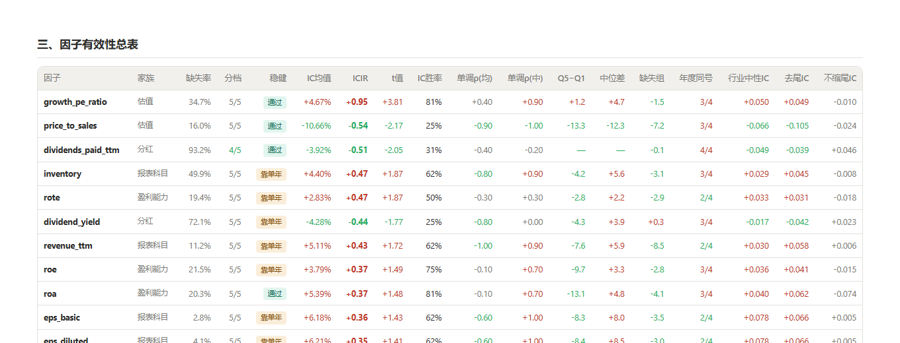
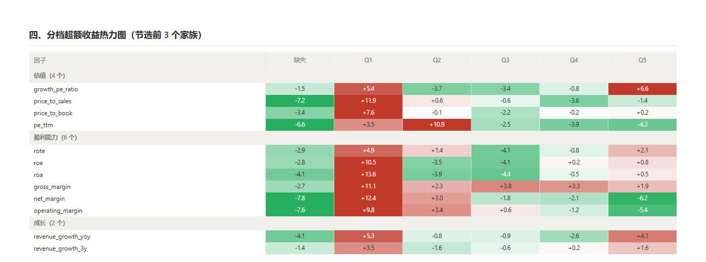
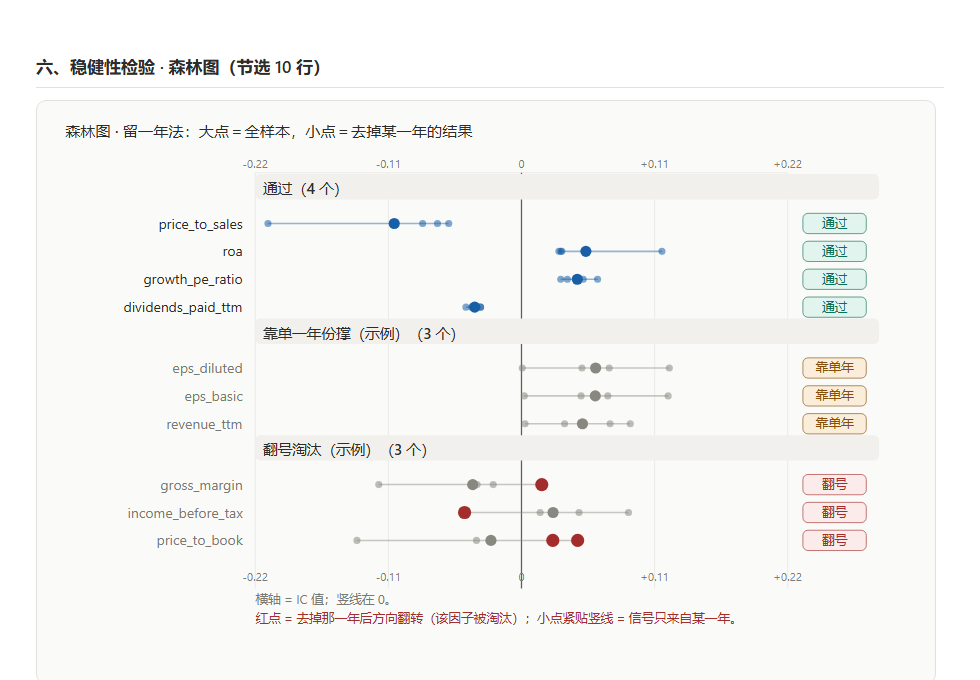
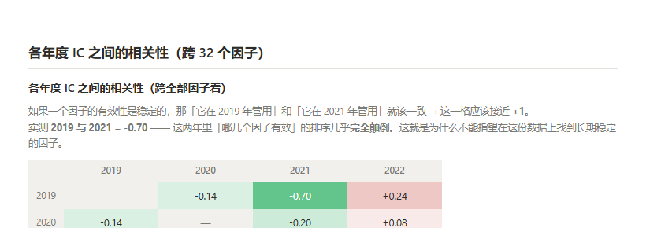
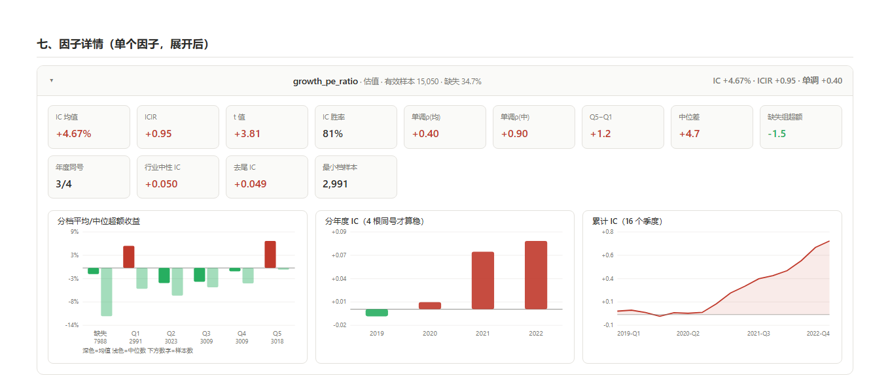

# 基本面因子研究 · Predict 1-Year US Stock Returns from Fundamentals

用一份美股财报面板数据，系统检验 **32 个财务指标到底能不能预测未来一年的股价涨跌**。

一次运行产出一份静态 HTML 报告 —— 零外部依赖、无需启动服务、双击即可打开：

```bash
python 因子分析.py        # 约 7 秒
# → 因子分析报告.html
```

> **注意：这是回测研究，不是实盘策略，也不构成任何投资建议。**
> 报告只基于**训练集（2019–2022）**。测试集是 2024 年、没有收益标签、`ticker` 已匿名化，
> **无法评估**，因此本项目的定位是"把因子研究的方法完整走一遍 + 得到一份诚实的结论"，
> 而不是"打比赛刷排名"。

---

## 一、结论摘要

### 1. 32 个字段里，只有 4 个经得起检验

用**留一年法**（把某一整年藏起来，看剩下三年还算不算得出同样结论）筛完的结果：

| 因子 | 含义 | IC | 方向 | 最弱口径/全样本 | 缺失率 |
|---|---|---|---|---|---|
| `price_to_sales` | 市销率 | −10.7% | 负向 | 57% | 16.0% |
| `roa` | 总资产回报率 | +5.4% | 正向 | 58% | 20.3% |
| `growth_pe_ratio` | 盈利增速相对估值 | +4.7% | 正向 | 70% | 34.7% |
| `dividends_paid_ttm` | 已付股利总额 | −3.9% | 负向 | 87% | **93.2%** |

最后一个要打折扣：它缺失 93.2%、只剩 4 档能用。
**真正既稳、覆盖又够的只有 `price_to_sales` 和 `roa`。**

### 2. 因子有效性在年份之间几乎不可迁移 ← 最根本的问题

跨 32 个因子看，各年度 IC 之间的相关性：

|  | 2019 | 2020 | 2021 | 2022 |
|---|---|---|---|---|
| 2019 | — | −0.14 | **−0.70** | +0.24 |
| 2020 | −0.14 | — | −0.20 | +0.08 |
| 2021 | **−0.70** | −0.20 | — | +0.26 |
| 2022 | +0.24 | +0.08 | +0.26 | — |

**2019 与 2021 强负相关（−0.70）**：这两年里"哪几个因子有效"的排序几乎完全颠倒。

举一个具体的例子：

| 指标 | 2019 年 | 2021 年 |
|---|---|---|
| `price_to_sales` | **+0.204**（当年最灵） | **−0.249**（当年最差） |
| `gross_margin` | **+0.195**（当年第二灵） | **−0.219**（当年倒数第二） |

**2019 年表现最好的两个指标，到 2021 年变成了最差的两个。**

### 3. 「财报数据缺失」本身就是负面信号

32 个因子里有 **30 个**的"缺失组"超额收益为负 —— 财报数据缺得多的公司，经营往往更差。

**结论：不要图省事直接把缺失样本 `WHERE 字段 IS NOT NULL` 删掉，那是在丢掉信息。**
本项目把缺失单列一组，全程不填不删。

### 4. 均值和中位数会打架

**17/32** 个因子的「单调ρ(均)」与「单调ρ(中)」**符号相反**。

最典型的是 `inventory`：按均值从 Q1 到 Q5 **递减**（−0.80），按中位数却是**递增**（+0.90）
—— 因为最小的那一档里混着几只暴涨股，把均值拉飞了。

**结论：这种情况必须以中位数口径为准。**

### 5. 这场比赛不是「建模能力」的比拼

用 2019–2021 训练、2022 验证（6,634 行），只喂 33 个基本面特征：

| 做法 | 验证集 MSE |
|---|---|
| 预测常数 / 训练集均值 | 4,276 |
| Ridge 线性回归 | 6,932 ← **比常数还差 62%** |
| 梯度提升树 | 5,118 |
| 梯度提升树 + 截断到 ±50% | **4,181** ← 最好的模型，只比常数好 2.2% |
| 对照：完美识别公司 + 重构收益误差 ±5 个百分点 | **24.9** |

不加截断时模型比"直接猜一个常数"还差 —— 因为它去拟合极端值，然后在验证集上被反向惩罚。
加了截断后，最好的成绩也只是比常数好 **2.2%**。

而榜一 MSE 是 2,058、榜六 4,421 —— **榜六基本就是"常数级"水平**。

---

## 二、数据

| 项目 | 说明 |
|---|---|
| 来源 | Kaggle 比赛 `predict-1-year-us-stock-returns-from-fundamentals` 的 `train.csv` |
| 规模 | 原始 **23,070 行 × 39 列** → 去重后 **23,038 行** |
| 覆盖 | **1,734 只美股** × **16 个季度截面**（2019-Q1 ~ 2022-Q4） |
| 一行是什么 | **某公司某个财季末的财报快照**，加上**该公司随后一年的股价涨跌幅**（`return_pct`） |

**几个必须知道的点：**

- **没有行情数据，是正常的。** 行情已经被"压缩"进 `return_pct` 这一列了。
  一行 = 33 个财务指标（输入）→ 一个涨跌幅百分比（输出），标准的有监督回归。
  比赛方故意不给行情，是为了隔离"光靠财报能不能预测股价"这个问题。
- **`return_pct` 是价格收益，不含分红。** 用 yfinance 复权价（含分红）反推会系统性高估所有分红股。
- **标签极端肥尾**：中位数只有 3.5%，但最大值 **+10,571%**、最小 −99.2%。
  所以全程用**缩尾后**的收益（1%/99% 分位）做分析。
- **测试集无法评估**：没有 `return_pct`、`ticker` 被匿名成 `stock_0000` 形式 ——
  既没答案、又不知道是谁，连外部补数据都做不到。
- 字段的完整含义、类型、缺失率、以及 **6 个官方文档没提的数据质量问题**，见 [`数据字典.md`](数据字典.md)。

---

## 三、报告长什么样

### 因子有效性总表（32 行 × 18 列）



按 |ICIR| 排序。最左边新增一列「稳健」，是留一年法的判定结果（见下方"方法与口径"）。

### 分档超额收益热力图 —— 全部因子一屏看



行 = 因子（按家族分组），列 = 5 个档位 + 缺失组。格子 = 该档平均超额收益（%）。
**真正有用的因子应该是一行颜色从绿渐变到红（单调）**，颜色杂乱的就是噪音。
红 = 正超额收益、绿 = 负（中国市场习惯）。

### 稳健性检验 · 森林图



每行一个因子。**大圆点 = 全样本 IC，4 个小圆点 = 去掉每一年的结果**，竖线在 0。
**5 个点全在竖线同一侧才算方向稳**；红点表示去掉那一年后翻到了另一边。

### 各年度 IC 之间的相关性



理想情况是这张表除对角线外**全是红色**（正相关）。实际正好相反。

### 单个因子的详情卡



13 个指标 + 三张图：**分档超额收益**（深色=均值、浅色=中位数）、**分年度 IC**、**累计 IC**。
全部 32 个因子的详情卡在报告第七节，点标题展开。

---

## 四、方法与口径

> 这一节说明每个数字是怎么算出来的。计算**全部**由 `因子分析.py` 完成，没有手工调整。

### 1. 去重

删掉「除 `id` 外所有列完全相同」的行，共 **32 行** —— 全部来自 `ET` 和 `PLD` 两只股票，
它们每个财季末都被记录了两遍。不去掉的话，这两只在加权统计里会被算成 2 倍权重。

（判重必须**排除 `id`**，因为 `id` 每行唯一，带上它就永远比不出重复。）

### 2. 截面定义 —— 项目里最容易搞错的一步

用 **`year(period_start) ‖ '-Q' ‖ quarter(period_start)`** 定义截面，得到 16 个截面。

**不能直接用 `period_start` 本身**，因为它是**各公司自己的财季末**而不是交易所交易日：

- 全表有 **381 个不同的 `period_start`**，中位数只有 **4 只股票**
- 同一个季度内能散出 20 多个日期（如 2019-Q1 有 22 个），
  最大的 `2019-03-31` 上有 984 只，最小的几个日期上**只有 1 只**
- 按日期分组 → 310 个组不足 30 只股票，纯噪音；按"年+季度"分组 → 每组 1,209~1,752 只

### 3. 标签处理

| 步骤 | 做法 |
|---|---|
| 缩尾 | `return_pct` 截断到 1% / 99% 分位 → **−81.01 ~ 328.28** |
| 边界来源 | **只用 2019–2021 计算**（不用 2022，避免泄漏） |
| 超额收益 | **每个截面内减去当期均值** |

减截面均值这一步不能省：不减会被大盘涨跌主导，**IC 和分组收益甚至会出现符号相反**。

### 4. 分档

每个截面内按字段取值**排名**等分成 5 档（Q1 最低 → Q5 最高），**缺失单独做第 6 组**。

- 用**排名**而不是数值分档 → 对极端值天然免疫（`roe` 最大 336 万 %，但排名不受影响）
- **缺失不能填也不能删**：`NTILE` 会把缺失当成最大值全塞进最后一档，
  实测 `roe` 的第 5 档 **98.5% 是缺失值**，结论会完全反过来
- 若某字段有大量并列值，档位会分不满（如 `dividends_paid_ttm` 实际只有 4 档），
  总表「分档」列会标出来

### 5. IC 口径

- 主口径 **Rank IC**：每个截面算一次「因子排名」与「超额收益排名」的 Spearman 相关，
  再对所有截面取平均
- `ICIR = IC 均值 ÷ IC 标准差`；`t 值 = ICIR × √截面数`
- 一个截面少于 30 只股票、或取值少于 5 种时，该截面不计入
- 另有两个对照口径：`行业中性IC`（截面×行业内去均值后重算）、`去尾IC`（剔除收益两端各 1% 后重算）

### 6. 稳健性检验 —— 留一年法

这是本项目最核心的一步。**只看「全样本 IC」会被单一年份劫持**，所以要藏起每一年再算一遍：

每个因子算 **5 个口径**的 IC：全样本（16 期）+ 去掉 2019 / 2020 / 2021 / 2022（各 12 期）。

| 关卡 | 判据 |
|---|---|
| 第 1 关 · 方向一致 | 5 个数字必须同号 |
| 第 2 关 · 不靠单一年份 | 最弱的那个，绝对值 ≥ 全样本的一半 |
| 第 3 关 · 换个算法还成立 | 行业中性化后、以及去掉极端样本后，符号不变 |

判定结果分四档：

| 判定 | 含义 |
|---|---|
| **通过** | 去掉任何一年结论都不变 |
| **靠单年** | 方向没翻，但信号只来自某一年，去掉它数值就近乎归零 |
| **算法敏感** | 换个口径（行业中性化 / 去掉极端样本）方向就变 |
| **翻号** | 去掉某一年后方向直接翻转 |

**为什么第 2 关不能省** —— 看 `eps_basic`（每股收益）：

| 年份 | 2019 | 2020 | **2021** | 2022 |
|---|---|---|---|---|
| IC | −0.027 | −0.085 | **+0.233** | +0.065 |

四年里三年都一般，只有 2021 特别灵。四年的平均 **+0.062** 完全是那一年抬起来的
—— 去掉 2021 再算，只剩 **+0.001**。所以它不是"稳定有效"，是"2021 那一年碰巧"。

对照 `roa`：+0.107 / −0.152 / +0.121 / +0.108 —— 去掉任何一年剩下的都还是正的，**这才是真信号**。

---

## 五、文件说明

```
Predict 1-Year US Stock Returns from Fundamentals/
├── README.md                  ← 本文件
├── 因子分析.py                 ← 全部功能（单文件，约 1,270 行）
├── 因子分析报告.html            ← 全部结果（静态 HTML，双击即开）
├── 数据字典.md                 ← 39 个字段的中文含义 / 类型 / 缺失率 + 6 个数据质量问题
├── fig/                       ← 本 README 用的插图
│   ├── 01-summary-table.png
│   ├── 02-heatmap.png
│   ├── 03-forest.png
│   ├── 04-year-corr.png
│   └── 05-detail-card.png
├── 方案贴解读/                 ← 比赛第 3 名 / 第 6 名方案的中英对照解读
│   ├── 第3名-指纹匹配与收益重构/
│   └── 第6名-SEC指纹与收益重构/
└── data/                      ← 数据目录（train/test 不入库，需自行下载）
    ├── README.md              ← 下载命令与文件说明
    ├── train.csv              ← 训练集（需下载）
    ├── test.csv               ← 测试集（需下载，无标签）
    └── sample_submission.csv  ← 提交格式样例（已入库）
```

> **注意：`train.csv` 与 `test.csv` 不在本仓库里**，需自己从 Kaggle 下载。
>
> 下载地址（网页方式，不需要任何配置）：
> **https://www.kaggle.com/competitions/predict-1-year-us-stock-returns-from-fundamentals/data**
>
> 打开后 → 登录 Kaggle →（若页面提示就先点 `Join Competition`）→ 右上角 **Download All** → 解压到本目录下的 `data/`。
> 详细步骤见 `data/README.md`。

> `方案贴解读/` 记录的是**这场比赛榜单的真实性质** ——
> 前三名方案的核心不是建模，而是"去匿名化 + 识别异常标签"。
> 留着它是作为复盘/写作时的原始证据。

### 怎么改

`因子分析.py` 顶部的**配置区**是唯一需要动的地方：

```python
CSV_DIR    = BASE / "data"          # 数据目录
OUT_HTML   = BASE / "因子分析报告.html"
N_GROUPS   = 5                      # 分档数
FAMILIES   = [...]                  # 因子家族（只影响展示顺序）
CUSTOM_FACTORS = {...}              # 想算字段组合时，在这里写 SQL
```

**因子不用手写 33 条 SQL** —— 默认按字段名自动生成。想自定义（比如 `roe - 行业中位数`），
在 `CUSTOM_FACTORS` 里写一条返回 `id` / `value` 两列的 SQL 覆盖即可。

---

## 六、已知限制

1. **只有 16 个截面。** 日频数据通常是几百到上千个 —— 这里 ICIR、t 值、分年度 ICIR 的
   **统计功效很弱**，只能当方向参考，**不要当显著性结论**。
2. **因子有效性在年份间不可迁移**（2019 vs 2021 = −0.70）。这是本数据集最根本的限制，
   意味着不要把这里的结论当成可用的策略。
3. **没有多持有期。** 每行只有一个固定的 1 年收益，所以做不了 IC 衰减 / 半衰期这类指标。
4. **测试集无法评估**（无标签 + 匿名 ticker）。所有结论都来自训练集内部的时间切分。
5. **`return_pct` 是价格收益，不含分红。** 对高分红股票的结论会偏。

> 一句话总结：**这份数据适合把因子研究的方法完整走一遍，但得不出可靠的因子结论。**
> 本项目最大的价值是把「怎么诚实地下结论」这件事演示清楚 ——
> 包括那些看起来很好、但经不起检验的因子是怎么被筛掉的。

---

## 七、运行环境

| 依赖 | 版本 |
|---|---|
| Python | 3.13（conda 环境 `vnpy`） |
| duckdb | ≥ 1.4 |
| pandas / numpy | 自带 |

**不需要 matplotlib、不需要 Flask、不需要联网** —— 报告里的所有图表都是手写内联 SVG。

```bash
python 因子分析.py
```

脚本会自动定位同目录下的 `data/train.csv`。
（**克隆本仓库后需先按上一节说明下载数据**，否则脚本会提示找不到文件。）

---

## 附：参考

- [数据字典.md](数据字典.md) —— 字段含义 + 数据质量问题清单
- [方案贴解读/](方案贴解读/) —— 比赛第 3、6 名方案的中文解读与英文原文
